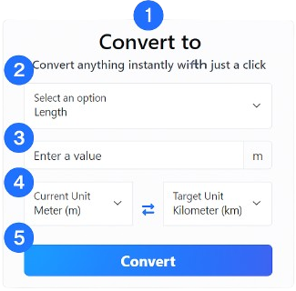

# 🌐 Convert.to

GitHub: https://github.com/rezelay/Convert.to

Uma aplicação simples e intuitiva para conversão de unidades de medida.  
Permite converter valores em diferentes categorias como comprimento, peso, volume, temperatura e mais, de forma rápida e prática.

---

## Changelog (Entrega Final)

- Adicionado integração com API externa para dar suporte a nova funcionalidade de cotações de moedas
- Adicionado suporte a PWA
- Detecção de interrupções na conexão com a internet
- Cache-first service worker
- Publicação no GitHub Pages movida para uma Action
- Novo passo do Lighthouse adicionado a Action existente anteriormente.

---

## 🚀 Funcionalidades

- Seleção da **categoria de conversão** (ex.: comprimento, peso, temperatura).
- Entrada de **valor numérico** a ser convertido.
- Definição da **unidade de origem** e da **unidade de destino**.
- Conversão **instantânea** com apenas um clique.
- Conversões de **moedas** com cotações atualizadas diariamente
- Interface clara e amigável, com suporte a diferentes unidades de medida.

---

## 🖼️ Interface



A interface é composta por:

1. **Título** – Indica a funcionalidade da aplicação.  
2. **Descrição** – Orienta o usuário sobre o uso da ferramenta.  
3. **Seleção de categoria** – Define o tipo de grandeza a ser convertida.  
4. **Campo de entrada** – Onde o valor numérico é digitado.  
5. **Unidade de origem e destino** – Escolha da unidade inicial e final.  
6. **Botão de conversão** – Executa a operação e exibe o resultado.  

---

## 🛠️ Tecnologias utilizadas

- **HTML5** e **CSS3** → Estrutura e estilo da interface.  
- **JavaScript** → Lógica de conversão e interação dinâmica.  
- **Frameworks/Bibliotecas** → Bootstrap v5.  

---

## 📂 Estrutura do projeto

```bash
Convert.to/
└── docs/                   # GitHub Pages
└── src/
    └── img/                # Estrutura principal
        └── icon.png        # Ícone do projeto
    ├── main.js             # Lógicas de conversão
    └── manifest.json       # Manifesto de extensão (v3)
    └── popup.html          # Interface da extensão
└── README.md               # Esta documentação
```

---
## 📄 Licença

Este projeto está sob a licença [MIT](./LICENSE).